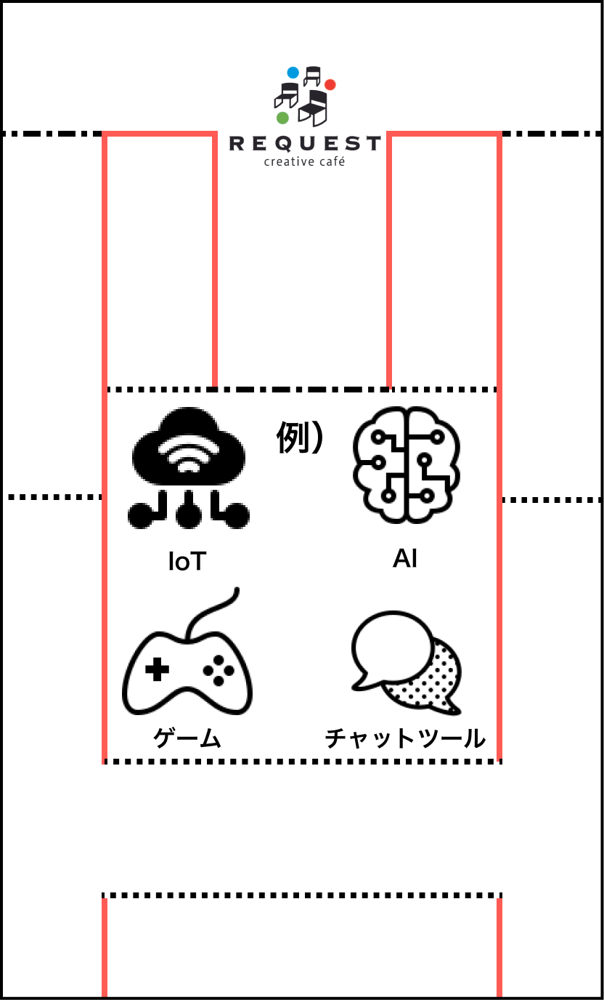

# 1 DRINK SUPPORT

対象　ドリンク単品またはセットを注文したお客様

対応方法

- 出勤したら

  - 「1 ドリンクサポート　本日のスタッフ」のボードに自分の名前のプレートを貼る。
  - 忙しい場合は外す。空いたらつける。
  - 誰も対応できるスタッフがいない場合は「本日対応できるスタッフがいません」プレートをつける。

- ドリンク単品まはたセットを注文したお客様が現れたら

  1.  1 DRINK SUPPORT ベーシックプランのカードを渡す。

      

  2.  「こちら ONE DRINK SUPPORT 　ベーシックプランのカードでございます。（ボードを指して）対応できるスタッフと内容はこちらのボードで確認できます。相談したい内容がある場合はカードを持ってレジのスタッフにお渡しください。」

      

- 「使いたい」と言われたら

  1. 砂時計とペンをもってお客様の席に向かう

    

  2. 「お待たせしました。本日は何を相談されますか？」内容を聞く

  - 対応可能な場合

    1.  ボードの「対応中」に自分のプレートを移す
    2.  カードに内容と日付、自分の名前を書く（ニックネーム）

        

    3.  向かいの席に座り、砂時計をひっくり返す
    4.  相談に乗ってあげる。

        - 困った場合は、「あくまで学生としての意見ですが、〇〇と思います。」と自分の意見を述べる。専門家ではないので、経験上での話で OK。

    5.  15 分たったら

        - 「それでは 15 分になりましたので、相談は以上になります。もしまた困ったことがあったらまたお声がけください。ありがとうございました。」
        - 15 分に満たなくても、満足そうでしたら早めに切り上げて OK。
        - ボードを「対応中」から外して元通りにする。

  - 対応できない場合（15 分ではできない・難易度が高い・対応できるスタッフがいない）

    - 15 分ではできない場合・難易度が高い場合

      - 「申し訳ありませんがその内容ですと 15 分では対応が難しいので、もしよろしけれな後日対応できるスタッフを用意します。（メニューのアドバンスプランを見せながら）1 時間 3500 円でドリンクがつきます。」

        - 予約する場合

          - TimeTree の「IT 相談予約可」で登録されている日程の中で日程を調整する。「お電話と、お越しになられる日程を教えてください。」

            

        - 予約しない場合
          - 「承知いたしました」

    - 対応できるスタッフが以内場合（人員的に）
      - 「大変申し訳ありませんが現在対応できるスタッフがいませんので、もう少々お待ちいただくか、また後日にお越しください。」
